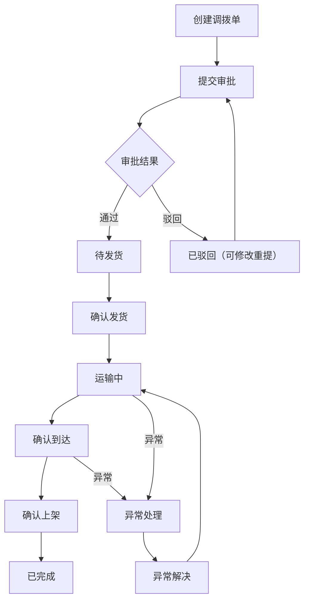
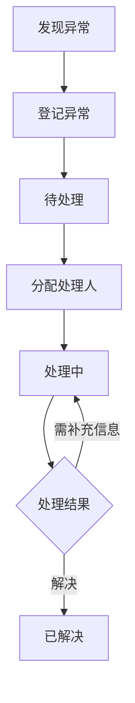

## 1. 产品概述

调拨管理系统是一套面向跨境电商/供应链企业的库存调拨全流程管理平台，解决多仓之间库存调拨的创建、审批、在途跟踪、异常处理和数据报表等核心问题。目标用户为供应链运营人员、仓库管理员和物流协调员，核心价值在于提升调拨效率、降低异常率、实现全链路可视化。

## 2. 核心功能

### 2.1 用户角色

| 角色 | 注册方式 | 核心权限 |
|------|----------|----------|
| 管理员 | 系统预设 | 全部功能，审批调拨单，系统设置 |
| 运营人员 | 管理员创建 | 创建/编辑调拨单，查看在途和报表 |
| 仓库管理员 | 管理员创建 | 确认发货/到货/上架，处理异常 |

### 2.2 功能模块

1. **数据看板**: 核心指标统计、状态分布、异常预警、SKU在途TOP、物流商概况、最近调拨单
2. **调拨单管理**: 调拨单列表（筛选/搜索/分页）、创建调拨单（多SKU明细）、调拨单详情、审批流程、批量导入
3. **在途管理**: SKU在途统计、目的地在途统计、物流商在途统计
4. **调拨跟踪**: 全链路跟踪（创建→备货→发货→运输→到达→上架）、时间轴视图
5. **物流商管理**: 物流商档案CRUD、物流商在途货物
6. **异常管理**: 异常登记、异常列表、异常统计
7. **数据报表**: 调拨概览、时效分析
8. **系统设置**: 仓库配置、用户管理

### 2.3 页面详情

| 页面名称 | 模块名称 | 功能描述 |
|----------|----------|----------|
| 数据看板 | 统计卡片 | 本月调拨单数、已上架完成、运输中、异常调拨单，含趋势指标 |
| 数据看板 | 状态分布 | 待发货/运输中/已到达/已上架/异常的状态条形图 |
| 数据看板 | 异常预警 | 待处理异常列表，点击跳转异常详情 |
| 数据看板 | SKU在途TOP5 | 在途数量最多的SKU排行及目的地分布 |
| 数据看板 | 物流商概况 | 各物流商在途单数和数量 |
| 数据看板 | 最近调拨单 | 最新5条调拨单简要信息 |
| 调拨单列表 | 筛选栏 | 按单号、SKU、类型、状态、物流商、日期范围筛选 |
| 调拨单列表 | 数据表格 | 展示调拨单号、类型、SKU明细、总数量、出发地、目的地、物流商、运单号、时间、状态、操作 |
| 调拨单列表 | 操作按钮 | 详情、跟踪、确认上架（已到达状态） |
| 创建调拨单 | 基本信息 | 类型、单号、运输方式、出发地、目的地、物流商、运单号、时间 |
| 创建调拨单 | SKU明细 | 动态添加/删除SKU行，每行含SKU编码和数量 |
| 创建调拨单 | 提交审批 | 保存后进入待审批状态 |
| 调拨单详情 | 详情展示 | 完整调拨单信息、SKU明细、物流链路可视化、操作日志 |
| 调拨单详情 | 审批操作 | 管理员审批通过/驳回 |
| 调拨单详情 | 状态流转 | 待审批→待发货→运输中→已到达→已上架 |
| 批量导入 | 文件上传 | 拖拽上传Excel/CSV，模板下载 |
| 批量导入 | 字段说明 | 模板字段说明表格 |
| SKU在途统计 | 筛选查询 | 按SKU、目的地筛选 |
| SKU在途统计 | 数据表格 | SKU、在途总数量、调拨单数、目的地分布、预计到达、物流商 |
| 目的地在途 | 数据表格 | 目的地、在途调拨单数、SKU数、总数量、本周/下周预计到达 |
| 物流商在途 | 数据表格 | 物流商、在途单数、SKU数、总数量、目的地分布 |
| 全链路跟踪 | 搜索查询 | 按调拨单号/SKU搜索 |
| 全链路跟踪 | 链路可视化 | 创建→备货→发货→运输→到达→上架，已完成/进行中/待完成状态 |
| 全链路跟踪 | SKU明细 | 调拨单下各SKU状态 |
| 时间轴视图 | 数据表格 | 各调拨单的时间节点和总耗时 |
| 物流商档案 | CRUD | 新增/编辑/查看物流商信息 |
| 物流商在途 | 数据表格 | 物流商维度查看在途调拨单 |
| 异常列表 | 筛选查询 | 按调拨单号、异常类型、处理状态筛选 |
| 异常列表 | 操作按钮 | 处理、详情 |
| 异常统计 | 统计卡片 | 本月异常数、待处理、处理中、已解决 |
| 调拨概览 | 统计+图表 | 月度调拨总量、件数、完成率、异常率 |
| 时效分析 | 数据表格 | 各线路平均耗时、最快/最慢 |
| 仓库配置 | CRUD | 国内仓/目的地仓库的新增/编辑 |
| 用户管理 | CRUD | 用户的新增/编辑/角色分配 |

## 3. 核心流程

### 调拨单全生命周期流程

用户创建调拨单 → 提交审批 → 管理员审批通过 → 待发货状态 → 仓库确认发货 → 运输中 → 货物到达目的地 → 仓库确认上架 → 完成。若过程中出现异常（数量不符、货损、超时等），进入异常处理流程。

### 异常处理流程

## 4. 用户界面设计

### 4.1 设计风格

- **主色调**: 深蓝 (#0F172A) 侧边栏 + 白色主内容区，强调色使用靛蓝 (#4F46E5)
- **辅助色**: 绿色 (#10B981) 成功/完成、琥珀色 (#F59E0B) 警告/待处理、红色 (#EF4444) 异常/错误
- **按钮风格**: 圆角8px，主按钮实心填充，次按钮描边
- **字体**: 标题使用 DM Sans，正文使用 Noto Sans SC（中文优化）
- **布局风格**: 左侧固定侧边栏 + 顶部导航栏 + 内容区卡片布局
- **图标风格**: Lucide React 线性图标，16-20px

### 4.2 页面设计概览

| 页面名称 | 模块名称 | UI元素 |
|----------|----------|--------|
| 数据看板 | 统计卡片 | 4列网格，图标+数值+趋势，渐变背景图标 |
| 数据看板 | 状态分布 | 进度条，5种状态颜色，百分比宽度 |
| 数据看板 | 异常预警 | 左侧红色边框卡片，图标+标题+描述+时间 |
| 调拨单列表 | 筛选栏 | 水平排列输入框/下拉框，查询按钮 |
| 调拨单列表 | 数据表格 | 斑马纹行，SKU标签组，状态徽章 |
| 创建调拨单 | 表单 | 3列网格表单，动态SKU表格，居中提交按钮 |
| 调拨单详情 | 链路可视化 | 水平步骤条，完成/进行中/待完成三种状态 |
| 全链路跟踪 | 时间轴 | 垂直时间轴，圆点+连线，动画脉冲效果 |
| 批量导入 | 上传区域 | 虚线边框拖拽区，大图标+说明文字 |

### 4.3 响应式设计

- 桌面优先设计，最小宽度1024px
- 平板适配：统计卡片2列，表格横向滚动
- 移动端：侧边栏抽屉式，统计卡片1列，表单单列

### 4.4 3D场景

不适用
