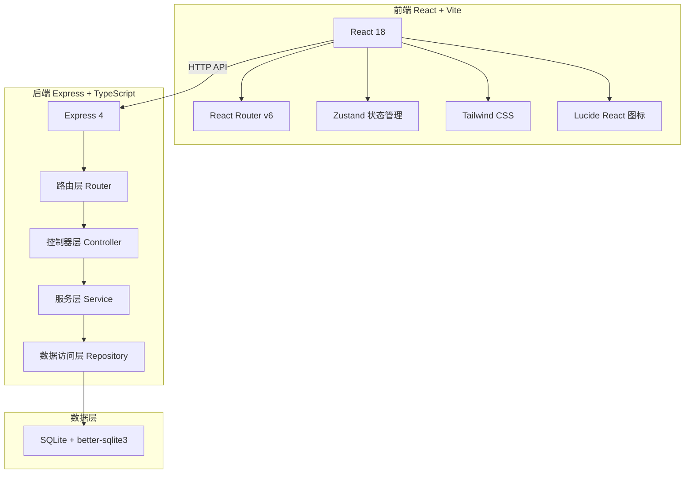
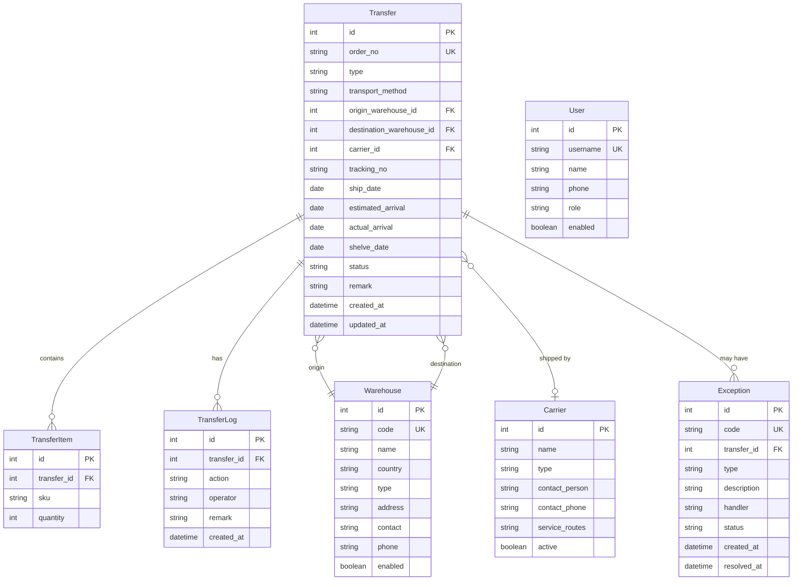

## 1. 架构设计



## 2. 技术说明

- **前端**: React@18 + TypeScript + Tailwind CSS@3 + Vite
- **初始化工具**: vite-init (react-express-ts 模板)
- **后端**: Express@4 + TypeScript (ESM)
- **数据库**: SQLite (better-sqlite3)，轻量级嵌入式数据库
- **状态管理**: Zustand
- **路由**: React Router v6 (前端) + Express Router (后端)
- **图标**: Lucide React

## 3. 路由定义

| 路由 | 用途 |
|------|------|
| `/` | 数据看板 |
| `/transfers` | 调拨单列表 |
| `/transfers/create` | 创建调拨单 |
| `/transfers/:id` | 调拨单详情 |
| `/transfers/import` | 批量导入 |
| `/transit/sku` | SKU在途统计 |
| `/transit/warehouse` | 目的地在途 |
| `/transit/carrier` | 物流商在途 |
| `/tracking` | 全链路跟踪 |
| `/tracking/timeline` | 时间轴视图 |
| `/carriers` | 物流商档案 |
| `/carriers/:id/transit` | 物流商在途货物 |
| `/exceptions` | 异常列表 |
| `/exceptions/stats` | 异常统计 |
| `/reports/overview` | 调拨概览 |
| `/reports/efficiency` | 时效分析 |
| `/settings/warehouses` | 仓库配置 |
| `/settings/users` | 用户管理 |

## 4. API定义

### 调拨单 API

```typescript
// GET /api/transfers - 获取调拨单列表（分页+筛选）
interface GetTransfersQuery {
  page?: number;
  pageSize?: number;
  keyword?: string;
  type?: 'FBA' | 'OVERSEAS' | '';
  status?: 'PENDING_APPROVAL' | 'APPROVED' | 'REJECTED' | 'PENDING_SHIP' | 'SHIPPED' | 'ARRIVED' | 'SHELVED' | '';
  carrierId?: number;
  startDate?: string;
  endDate?: string;
}

interface GetTransfersResponse {
  data: Transfer[];
  total: number;
  page: number;
  pageSize: number;
}

// POST /api/transfers - 创建调拨单
interface CreateTransferRequest {
  type: 'FBA' | 'OVERSEAS';
  orderNo: string;
  transportMethod: 'SEA' | 'AIR' | 'RAIL' | 'EXPRESS';
  originWarehouseId: number;
  destinationWarehouseId: number;
  carrierId?: number;
  trackingNo?: string;
  shipDate?: string;
  estimatedArrival?: string;
  items: { sku: string; quantity: number }[];
  remark?: string;
}

// GET /api/transfers/:id - 获取调拨单详情
interface TransferDetail extends Transfer {
  items: TransferItem[];
  logs: TransferLog[];
}

// PUT /api/transfers/:id/approve - 审批通过
// PUT /api/transfers/:id/reject - 审批驳回
// PUT /api/transfers/:id/ship - 确认发货
// PUT /api/transfers/:id/arrive - 确认到达
// PUT /api/transfers/:id/shelve - 确认上架
```

### 在途统计 API

```typescript
// GET /api/transit/sku - SKU在途统计
interface SkuTransitStats {
  sku: string;
  totalQuantity: number;
  transferCount: number;
  destinations: { warehouse: string; quantity: number }[];
  estimatedArrivalRange: string;
  carriers: string[];
}

// GET /api/transit/warehouse - 目的地在途统计
// GET /api/transit/carrier - 物流商在途统计
```

### 物流商 API

```typescript
// GET /api/carriers - 物流商列表
// POST /api/carriers - 新增物流商
// PUT /api/carriers/:id - 编辑物流商
// GET /api/carriers/:id/transit - 物流商在途货物
```

### 异常 API

```typescript
// GET /api/exceptions - 异常列表
// POST /api/exceptions - 登记异常
// PUT /api/exceptions/:id/process - 处理异常
// GET /api/exceptions/stats - 异常统计
```

### 报表 API

```typescript
// GET /api/reports/overview - 调拨概览
// GET /api/reports/efficiency - 时效分析
```

### 仓库 API

```typescript
// GET /api/warehouses - 仓库列表
// POST /api/warehouses - 新增仓库
// PUT /api/warehouses/:id - 编辑仓库
```

### 用户 API

```typescript
// GET /api/users - 用户列表
// POST /api/users - 新增用户
// PUT /api/users/:id - 编辑用户
```

### 数据看板 API

```typescript
// GET /api/dashboard - 看板数据
interface DashboardData {
  stats: {
    monthlyTransfers: number;
    completedTransfers: number;
    inTransitTransfers: number;
    exceptionTransfers: number;
    monthlyTrend: number;
    completedTrend: number;
    inTransitTrend: number;
    exceptionTrend: number;
  };
  statusDistribution: { status: string; count: number }[];
  recentExceptions: Exception[];
  topSkuInTransit: SkuTransitStats[];
  carrierOverview: { carrier: string; inTransitCount: number; inTransitQuantity: number; mainDestination: string }[];
  recentTransfers: Transfer[];
}
```

## 5. 服务端架构图


## 6. 数据模型

### 6.1 数据模型定义



### 6.2 数据定义语言

```sql
CREATE TABLE warehouses (
    id INTEGER PRIMARY KEY AUTOINCREMENT,
    code TEXT UNIQUE NOT NULL,
    name TEXT NOT NULL,
    country TEXT DEFAULT '',
    type TEXT NOT NULL CHECK(type IN ('DOMESTIC', 'FBA', 'OVERSEAS')),
    address TEXT DEFAULT '',
    contact TEXT DEFAULT '',
    phone TEXT DEFAULT '',
    enabled INTEGER DEFAULT 1,
    created_at TEXT DEFAULT (datetime('now')),
    updated_at TEXT DEFAULT (datetime('now'))
);

CREATE TABLE carriers (
    id INTEGER PRIMARY KEY AUTOINCREMENT,
    name TEXT NOT NULL,
    type TEXT DEFAULT '',
    contact_person TEXT DEFAULT '',
    contact_phone TEXT DEFAULT '',
    service_routes TEXT DEFAULT '',
    active INTEGER DEFAULT 1,
    created_at TEXT DEFAULT (datetime('now')),
    updated_at TEXT DEFAULT (datetime('now'))
);

CREATE TABLE transfers (
    id INTEGER PRIMARY KEY AUTOINCREMENT,
    order_no TEXT UNIQUE NOT NULL,
    type TEXT NOT NULL CHECK(type IN ('FBA', 'OVERSEAS')),
    transport_method TEXT NOT NULL CHECK(transport_method IN ('SEA', 'AIR', 'RAIL', 'EXPRESS')),
    origin_warehouse_id INTEGER NOT NULL REFERENCES warehouses(id),
    destination_warehouse_id INTEGER NOT NULL REFERENCES warehouses(id),
    carrier_id INTEGER REFERENCES carriers(id),
    tracking_no TEXT DEFAULT '',
    ship_date TEXT,
    estimated_arrival TEXT,
    actual_arrival TEXT,
    shelve_date TEXT,
    status TEXT NOT NULL DEFAULT 'PENDING_APPROVAL' CHECK(status IN ('PENDING_APPROVAL', 'APPROVED', 'REJECTED', 'PENDING_SHIP', 'SHIPPED', 'ARRIVED', 'SHELVED')),
    remark TEXT DEFAULT '',
    created_at TEXT DEFAULT (datetime('now')),
    updated_at TEXT DEFAULT (datetime('now'))
);

CREATE TABLE transfer_items (
    id INTEGER PRIMARY KEY AUTOINCREMENT,
    transfer_id INTEGER NOT NULL REFERENCES transfers(id) ON DELETE CASCADE,
    sku TEXT NOT NULL,
    quantity INTEGER NOT NULL CHECK(quantity > 0)
);

CREATE TABLE transfer_logs (
    id INTEGER PRIMARY KEY AUTOINCREMENT,
    transfer_id INTEGER NOT NULL REFERENCES transfers(id) ON DELETE CASCADE,
    action TEXT NOT NULL,
    operator TEXT DEFAULT '系统',
    remark TEXT DEFAULT '',
    created_at TEXT DEFAULT (datetime('now'))
);

CREATE TABLE exceptions (
    id INTEGER PRIMARY KEY AUTOINCREMENT,
    code TEXT UNIQUE NOT NULL,
    transfer_id INTEGER NOT NULL REFERENCES transfers(id),
    type TEXT NOT NULL CHECK(type IN ('QUANTITY_MISMATCH', 'OVERDUE_SHELVE', 'DAMAGED', 'LOST', 'OTHER')),
    description TEXT NOT NULL,
    handler TEXT DEFAULT '',
    status TEXT NOT NULL DEFAULT 'PENDING' CHECK(status IN ('PENDING', 'PROCESSING', 'RESOLVED')),
    created_at TEXT DEFAULT (datetime('now')),
    resolved_at TEXT
);

CREATE TABLE users (
    id INTEGER PRIMARY KEY AUTOINCREMENT,
    username TEXT UNIQUE NOT NULL,
    name TEXT NOT NULL,
    phone TEXT DEFAULT '',
    role TEXT NOT NULL DEFAULT 'OPERATOR' CHECK(role IN ('ADMIN', 'OPERATOR', 'WAREHOUSE')),
    enabled INTEGER DEFAULT 1,
    created_at TEXT DEFAULT (datetime('now')),
    updated_at TEXT DEFAULT (datetime('now'))
);

-- 初始数据
INSERT INTO warehouses (code, name, country, type, address, contact, phone) VALUES
('CN-SZ-01', '深圳仓', '中国', 'DOMESTIC', '深圳市龙岗区', '李经理', '13800138001'),
('CN-YW-01', '义乌仓', '中国', 'DOMESTIC', '义乌市稠江街道', '王经理', '13900139002'),
('CN-NB-01', '宁波仓', '中国', 'DOMESTIC', '宁波市北仑区', '张经理', '13700137003'),
('LAX9', '美国-LAX9', '美国', 'FBA', '', '', ''),
('ONT8', '美国-ONT8', '美国', 'FBA', '', '', ''),
('UK-BH', '英国-伯明翰', '英国', 'OVERSEAS', '', '', ''),
('DE-BL', '德国-柏林', '德国', 'FBA', '', '', ''),
('JP-TK', '日本-东京', '日本', 'OVERSEAS', '', '', '');

INSERT INTO carriers (name, type, contact_person, contact_phone, service_routes) VALUES
('中外运', '海运/空运', '王经理', '13800138001', '中国-美国/欧洲'),
('马士基', '海运', '李经理', '13900139002', '全球'),
('DHL', '快递/空运', '张经理', '13700137003', '全球'),
('顺丰国际', '快递', '赵经理', '13600136004', '中国-亚洲');

INSERT INTO users (username, name, phone, role) VALUES
('admin', '系统管理员', '13800138000', 'ADMIN'),
('operator', '运营专员', '13800138001', 'OPERATOR'),
('warehouse', '仓库管理员', '13800138002', 'WAREHOUSE');
